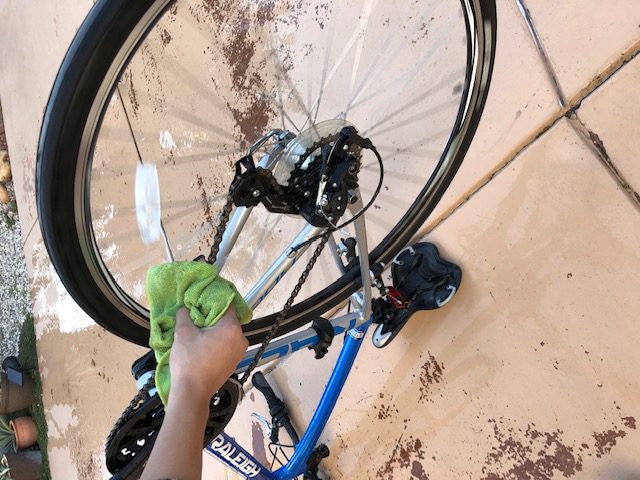
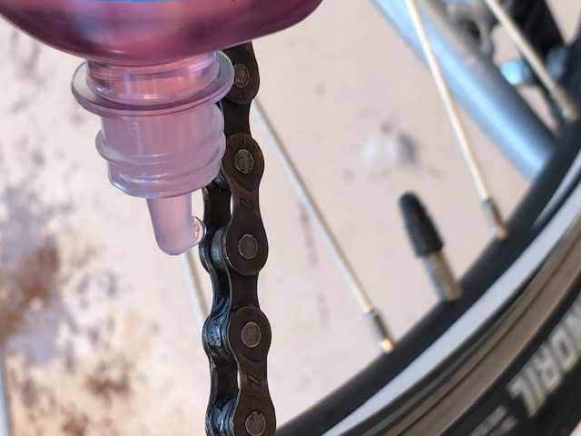
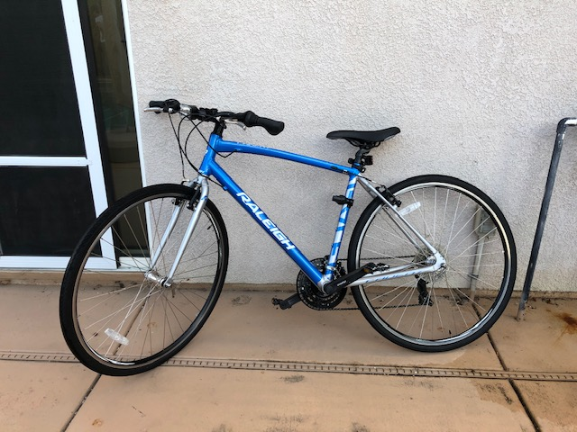

### Introduction  
Here's a guide on how to clean your bike. It includes washing the frame and lubricating the drivetrain but does not cover removing the wheels to access the brake pads. If you ride your bike often, I recommend following these instructions every few weeks, or after an especially muddy ride. Doing so will help to keep your bike running smoothly and help each component to last as long as possible.   
  

If you are not familiar with the parts of a bike referenced in this guide, here is a helpful [article](https://www.liv-cycling.com/global/campaigns/parts-of-the-bike/20452).  
If you are missing any of the necessary materials, this [supply list](https://www.amazon.com/hz/wishlist/ls/3VVK6NTBYWZNU?ref_=wl_share) has links to what I used.  
Also, here's a [printable PDF](ENGL%20149%20Instructions%20(draft3).pdf) in case you want to reference the instructions without getting your computer wet. 

### Set Up 
1\. Gather the necessary materials: 
* A medium-sized bucket/clean, empty trash can
* Dish soap
* Garden Hose
* Car sponge (alternative: old kitchen sponges)
* (2x) Microfiber rags(alternative: unwanted t-shirts)
* Old toothbrush
* Chain degreaser
* Wet chain lubricant 

  	

2\. Fill the bucket with roughly one gallon of water from the hose. 
3\. Pour in about 20 drops of dish soap. 
4\. Add another half-gallon of water from the hose and mix to form a bubbly mixture as shown below. 

  	

5\. Flip the bike so that the seat and the handlebars are touching the ground as shown in the picture below. *NOTE:* This will keep the bike upright and make it easier to spin the pedals to clean the drivetrain. 

  	

### Washing the Frame and Wheels 
6\. Using the hose, rinse off any large buildups of dirt using a low-pressure hose setting (for example, shower mode instead of jet mode). *NOTE:* Do not force water into the marked areas shown in this picture as this can lead to seized bearings. They can be wet, but do not force water inside the frame. 

  	

7\. Using your old toothbrush, brush away residue from the cassette and chainring. *NOTE:* There maybe a lot of residue, so you can rinse the brush in your bucket of soapy water. 

  	

8\. Dip the car sponge into the bucket of soapy water and wipe dirt off of the frame. 
9\. Use the sponge to thoroughly clean the rims and spokes of both wheels. 

  	

### Cleaning the Chain 
10\. Spray the chain degreaser liberally onto the chain and gears, spinning the pedals when necessary. *NOTE:* There are many kinds of chain degreaser; follow the directions for yours specifically. 

|   |   |  

11\. Let the degreaser sit on the components for two to five minutes. 
12\. Rinse the whole bike off completely with the hose. *NOTE:* Do not force water into the marked areas shown in step 6.  

  	

13\. Wipe the chain dry with the first microfiber cloth. Hold the cloth on the chain and turn the pedals. **CAUTION:** Keep your fingers out of moving components to avoid pinch points. 

  	

14\. Apply one drop of wet lubricant to each link of the chain, spinning the pedals slowly to ensure you get lubricant on each link. 

  	

 
### Finishing Up 
15\. After applying the lubricant, spin the pedals and shift to different gears to work the lubricant into the cassette and chainring. 
16\. Wipe off any excess lubricant with the first microfiber cloth. 
17\. Spin the pedal and shift the back gears up and down to check for smooth shifting. If there is loud creaking, apply more lubricant to the chain. 
18\. Wipe off excess water with the second microfiber cloth. 

  	

19\. Allow the bike to dry off in the sun to ensure that all components are dry. 

  	

